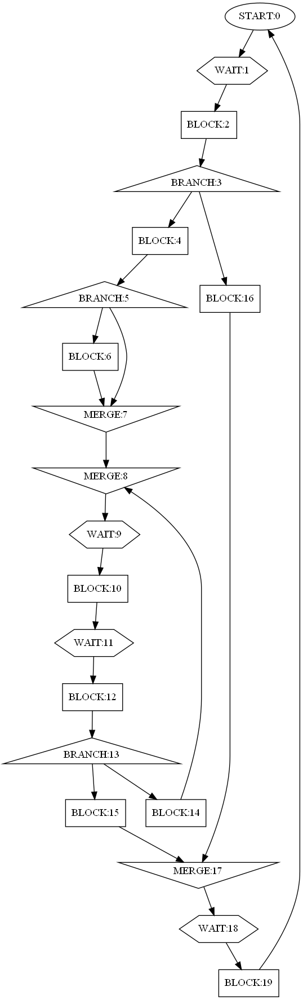
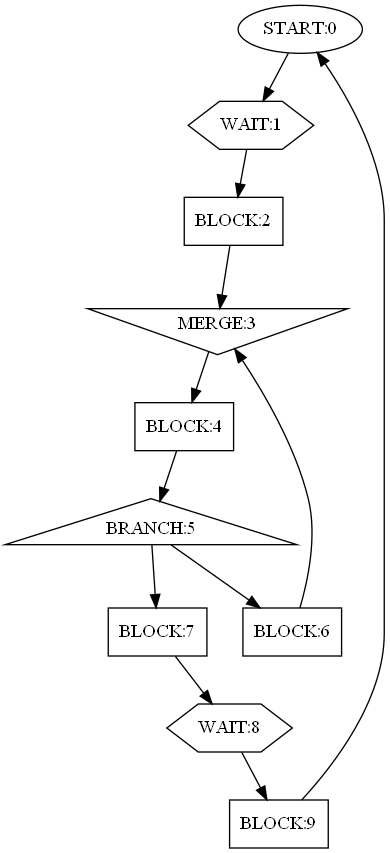
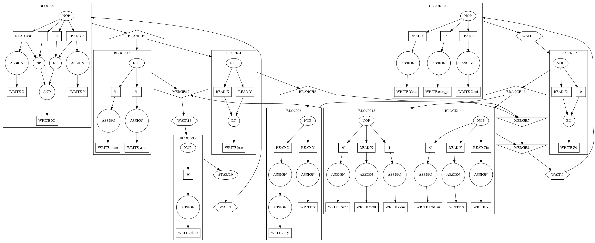
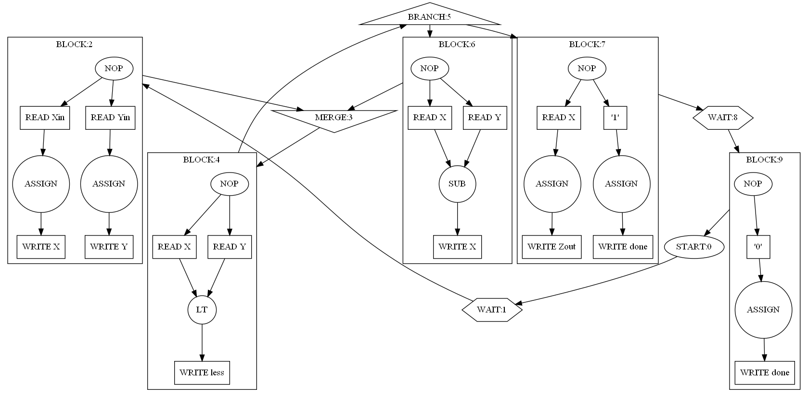
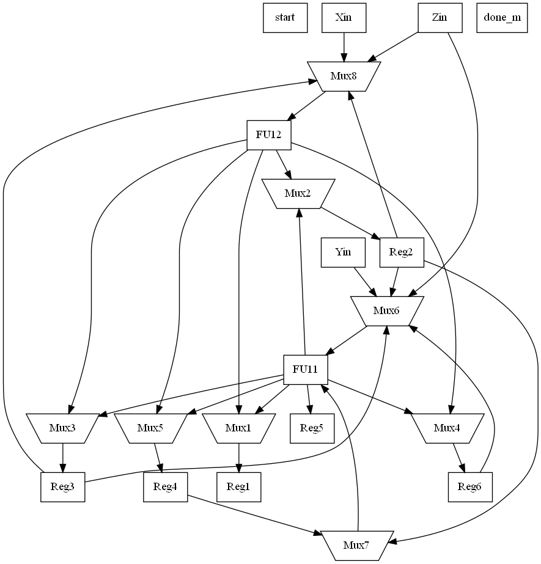
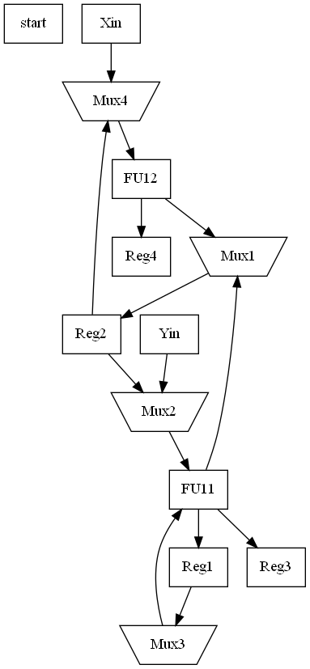
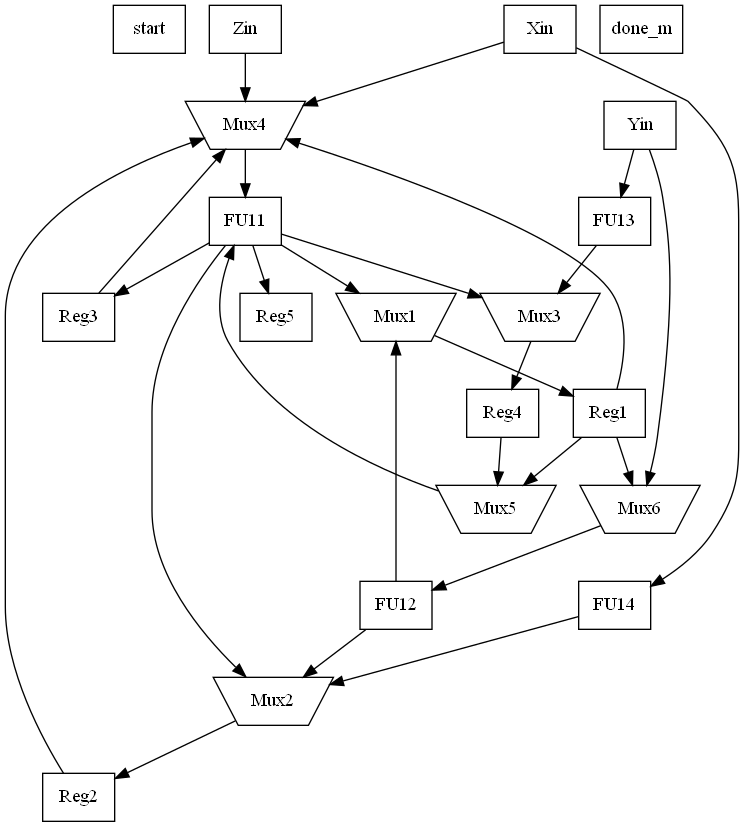
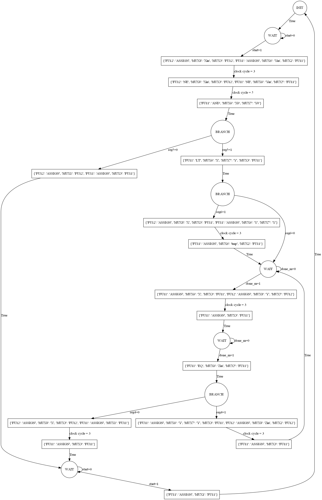
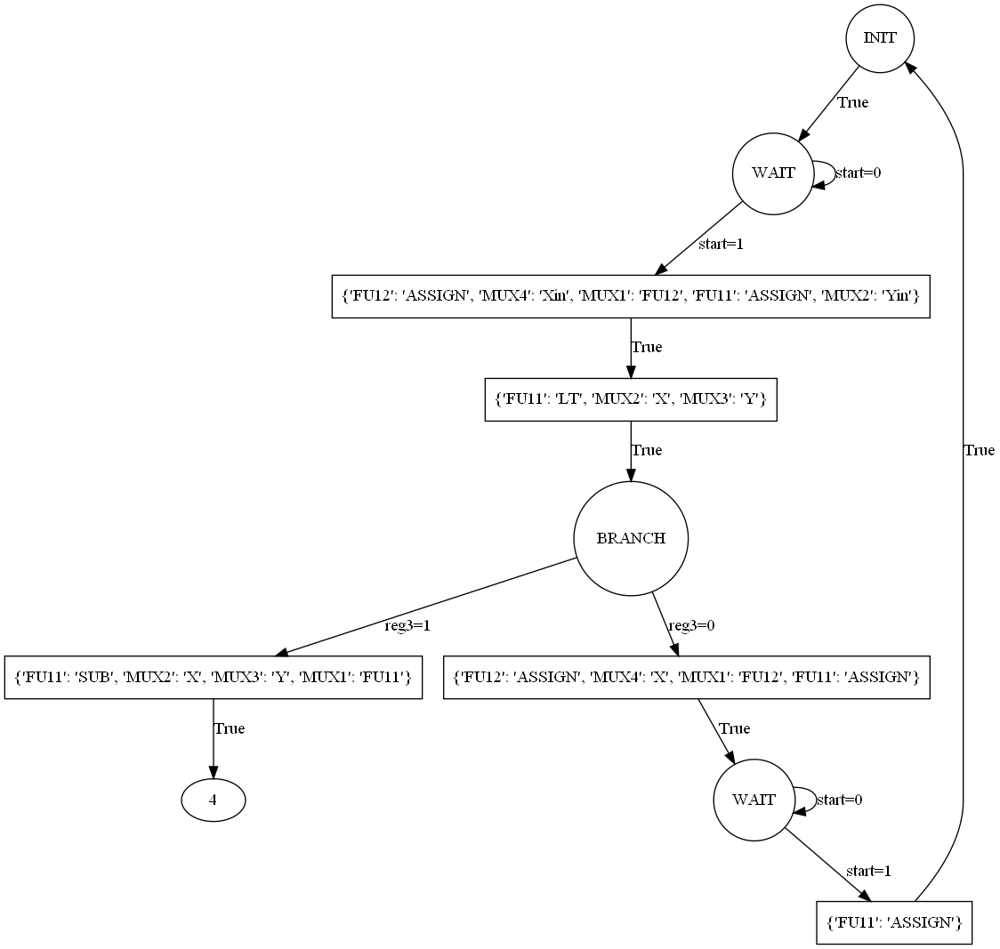
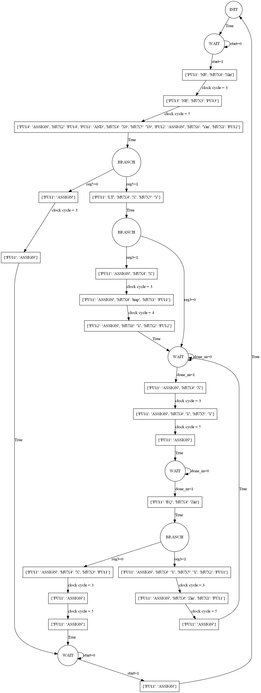

# High-level-synthesizer
Simplied version of Digital HLS  
Scheduler: List scheduling is used for both minimum latency and minimum resource  
Binder: Resource binding is done using clique partitioning and register binding is done via left edge algorithm  
Datapath: Muxes are used to interconnect registers and functional units  
Work is done by Naman Jain (IIT Delhi) as part of COL 719: Synthesis of digital systems Semester I (2021-22)

# Dependencies
Python Graphviz package

# Control flow graph

# Control and Data flow graph

# Example block interval graph

# Datapath
# Minimum latency

# Minimum resorce

# FSM for controller
# Minimum latency

# Minimum resorce

